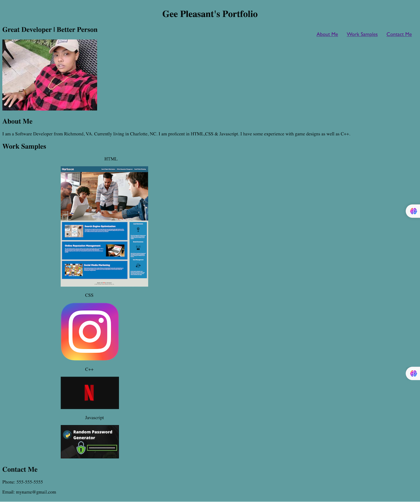

# Html Css Portfolio

## Description

Provide a short description explaining the what, why, and how of your project. Use the following questions as a guide:

- This project is to showcase the skills that I have learned in Module 2 of my Full-Stack Web Development class. Module 2 was an deeper dive into HTML, CSS, & Git.
- This project was created to teach me how to build code from scratch. This mock-up was to similate job tasks that I may encounter in the work force. 
- I learned :

    1. How to properly structure Semanitc HTML elements.
    2. That HTML has to follow the correct sequence of HTML tags.
    3. Properly use class selectors in CSS
    4. How to resize images.
    5. How to link a stylesheet to my html
    6. How to  add media query to my CSS for mobile adaptability.
    7. How to add alt attributes to images for accessibilty.
    8. How make navigation links
    9. How to make the UI scroll to the corresponding section in the navigation
    10. How to add links within a image that can be clickable and redirected to that page.

 

## Links

[Live URL](https://ggpleasant692.github.io/html-css-portfolio/)

[Github Repo](https://github.com/ggpleasant692/html-css-portfolio.git)